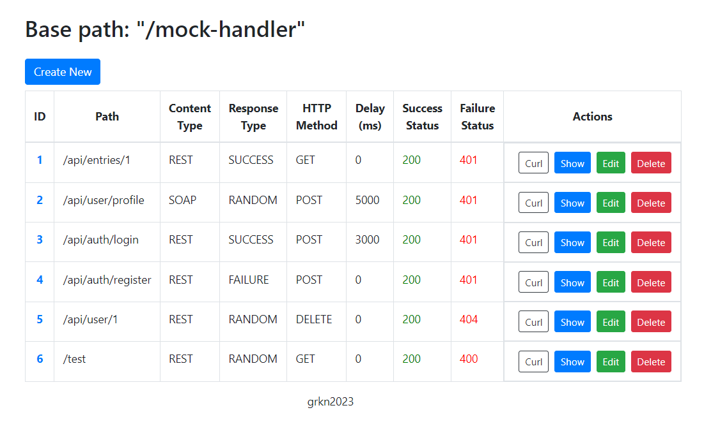

# HTTP Mock Server / Rest & SOAP

<p align=="center" width="100%">
    
</p>
<p align=="center" width="100%">
    

</p>
<p align=="center" width="100%">
    
    
</p>
<p align=="center" width="100%">
    
</p>

### How to run?

- set project java jdk to jdk11
- run the following command below

```shell
  mvn spring-boot:run
```

### it will run at [http://localhost:8090/mocks](http://localhost:8090/mocks)

## Features

- CRUD operations for endpoints
- Simple UI to manage
- Store data in h2 file db (shareable with other people)
- You can specify `ContentType`, `ResponseType` or add `Delay`

```
ResponseType {
  SUCCESS,
  FAILURE,
  RANDOM
}
```

```
ContentType {
  REST,
  SOAP;
}
```